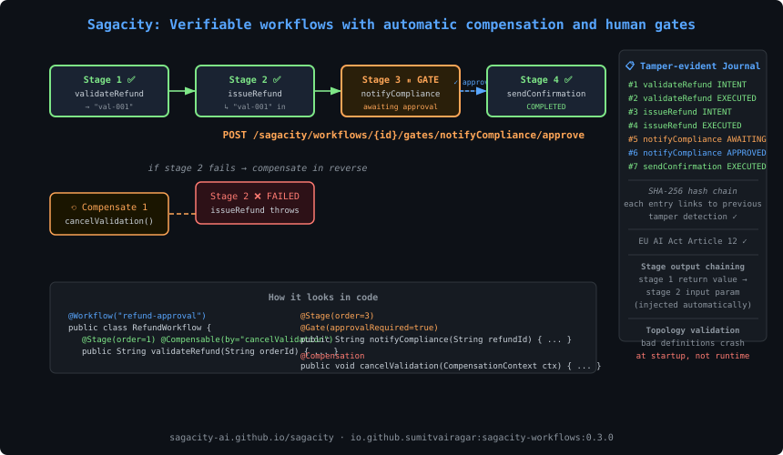

# Sagacity

[](LICENSE)
[](https://openjdk.org/)
[](https://spring.io/projects/spring-ai)
[](https://github.com/sagacity-ai/sagacity/actions/workflows/build.yml)
[](https://central.sonatype.com/artifact/io.github.sumitvairagar/sagacity-spring-boot-starter)
[](https://sagacity-ai.github.io/sagacity/)
[]()

**The reliability layer for Spring AI agents.** Declarative workflows, automatic compensation, tamper-evident audit trail, and human approval gates — in annotations.

<!-- Animated diagram: tools execute → failure → compensation flows backward -->
<p align="center">
  
</p>

---

## The Problem

AI agents perform multi-step tasks with **real-world side effects** — reserving inventory, creating orders, sending emails, charging cards. When step 4 fails:

- ❌ Steps 1–3's side effects are **live in production**
- ❌ Nothing undoes them automatically
- ❌ There's no compliance-grade record of what happened
- ❌ Nobody approved the irreversible action in step 3

Every framework retries. **None compensates. None produces evidence. None gates irreversible actions.**

---

## Two ways to use Sagacity

### Option A — Wrap individual tool calls

Annotate your Spring AI tools with `@Compensable`. Sagacity intercepts every call, journals it, and compensates in reverse if the saga fails.

```java
@Tool(description = "Reserve inventory")
@Compensable(by = "releaseInventory")
public String reserveInventory(String productId, int quantity) {
    return inventory.reserve(productId, quantity);  // returns "res-8891"
}

@Compensation
public void releaseInventory(CompensationContext ctx) {
    inventory.release(ctx.result());   // "res-8891"
}

@Tool(description = "Send wire transfer — cannot be undone")
@Compensable(reversibility = Reversibility.IRREVERSIBLE)
public String sendWireTransfer(String orderId) {
    // pauses the saga until a human approves via REST
    return payments.wire(orderId);
}
```

```java
SagaResult<ChatResponse> result = sagacity.saga("order-123", () ->
    chatClient.prompt()
        .user("Place order for 2 units of product p-1")
        .toolCallbacks(sagacity.wrap(orderTools))
        .call().chatResponse());
```

### Option B — Declare a verifiable workflow (`sagacity-workflows`)

Define the entire multi-step process as annotated stages. The runtime executes them in order, chains outputs as inputs, and compensates in reverse on any failure. Human gates, pre-flight checks, and async execution are first-class features.

```java
@Workflow("refund-request")
@Component
public class RefundWorkflow {

    @Stage(order = 1)
    @Compensable(by = "cancelRefund")
    public RefundConfirmation issueRefund(String orderId) {
        return payments.refund(orderId);
    }

    @Stage(order = 2)
    @Check(BudgetCheck.class)                    // pre-flight: block if budget exceeded
    @Gate(approvalRequired = true)               // pause: wait for human before proceeding
    @Compensable(by = "revertEmail")
    public void notifyCustomer(RefundConfirmation refund) {
        email.send(refund.customerId(), "Your refund is processing");
    }

    @Compensation
    public void cancelRefund(CompensationContext ctx) { payments.reverse(ctx.result()); }

    @Compensation
    public void revertEmail(CompensationContext ctx) { email.retract(ctx.result()); }
}
```

```java
// Async — workflow pauses at the @Gate until someone approves
WorkflowHandle handle = workflowRuntime.runAsync(refundWorkflow, orderId);

// Approve via REST or programmatically
workflowRuntime.approveGate(handle.runId(), "notifyCustomer");

handle.awaitCompletion(60, TimeUnit.MINUTES);
// → WorkflowStatus.COMPLETED
```

---

## Documentation

Full documentation: **[sagacity-ai.github.io/sagacity](https://sagacity-ai.github.io/sagacity/)**

| | |
|---|---|
| [Getting started](https://sagacity-ai.github.io/sagacity/getting-started/) | Working example in five minutes |
| [Verifiable workflows](https://sagacity-ai.github.io/sagacity/guides/workflows/) | `@Stage`, `@Gate`, `@Check` — the full workflow engine |
| [Approval gates](https://sagacity-ai.github.io/sagacity/guides/approval-gates/) | Human sign-off for irreversible tools |
| [Production checklist](https://sagacity-ai.github.io/sagacity/guides/production-checklist/) | Read before pointing this at real money |
| [Threat model](https://sagacity-ai.github.io/sagacity/concepts/threat-model/) | What the audit trail does and does not defend against |
| [REST API](https://sagacity-ai.github.io/sagacity/reference/rest-api/) | Endpoint reference |
| [Annotations](https://sagacity-ai.github.io/sagacity/reference/annotations/) | `@Compensable`, `@Workflow`, `@Stage`, `@Gate`, `@Check` |

---

## Quick Start

> **Want a runnable example in 5 minutes?**
> Clone [sagacity-quickstart](https://github.com/sumitvairagar/sagacity-quickstart) — a self-contained Spring Boot app that shows compensation and the audit trail in action. Just add your API key and run.

### 1. Add the dependency

```xml
<!-- Core: tool-call compensation + audit trail -->
<dependency>
    <groupId>io.github.sumitvairagar</groupId>
    <artifactId>sagacity-spring-boot-starter</artifactId>
    <version>0.3.0</version>
</dependency>

<!-- Optional: declarative workflow engine -->
<dependency>
    <groupId>io.github.sumitvairagar</groupId>
    <artifactId>sagacity-workflows</artifactId>
    <version>0.3.0</version>
</dependency>
```

### 2. Annotate your tools

```java
@Component
public class OrderTools {

    @Tool(description = "Reserve inventory for a product")
    @Compensable(by = "releaseInventory")
    public String reserveInventory(String productId, int quantity) {
        return inventoryService.reserve(productId, quantity);  // returns reservation ID
    }

    @Compensation
    public void releaseInventory(CompensationContext ctx) {
        inventoryService.release(ctx.result());   // ctx.result() = reservation ID
    }

    @Tool(description = "Charge the customer")
    @Compensable(by = "refundCustomer", retries = 3, retryOn = { PaymentTimeoutException.class })
    public String chargeCustomer(String customerId, double amount) {
        return paymentService.charge(customerId, amount);
    }

    @Compensation
    public void refundCustomer(CompensationContext ctx) {
        paymentService.refund(ctx.result());
    }

    @Tool(description = "Send wire transfer — cannot be undone")
    @Compensable(reversibility = Reversibility.IRREVERSIBLE)
    public String sendWireTransfer(String orderId) {
        // Saga pauses here. REST approve/reject before this executes.
        return payments.wire(orderId);
    }
}
```

### 3. Run your agent in a saga

```java
@Service
public class OrderAgent {

    @Autowired private Sagacity sagacity;
    @Autowired private ChatClient chatClient;
    @Autowired private OrderTools orderTools;

    public SagaResult<ChatResponse> placeOrder(String userRequest) {
        return sagacity.saga("order-" + UUID.randomUUID(), () ->
            chatClient.prompt()
                .user(userRequest)
                .toolCallbacks(sagacity.wrap(orderTools))
                .call().chatResponse());
    }
}
```

### 4. Or declare a verifiable workflow

```java
@Workflow("order-placement")
@Component
public class OrderWorkflow {

    @Stage(order = 1)
    @Compensable(by = "releaseInventory")
    public Reservation reserveInventory(String orderId) { ... }

    @Stage(order = 2)
    @Compensable(by = "refundCharge")
    public ChargeReceipt chargeCard(Reservation reservation) {
        // 'reservation' automatically injected from stage 1's return value
        ...
    }

    @Stage(order = 3)
    @Gate(approvalRequired = true, reason = "Wire transfer cannot be undone")
    public void wireTransfer(ChargeReceipt receipt) { ... }

    @Compensation public void releaseInventory(CompensationContext ctx) { ... }
    @Compensation public void refundCharge(CompensationContext ctx) { ... }
}
```

```java
WorkflowHandle handle = workflowRuntime.runAsync(orderWorkflow, orderId);
// Workflow pauses at step 3 → approve via REST or programmatically
workflowRuntime.approveGate(handle.runId(), "wireTransfer");
handle.awaitCompletion(30, TimeUnit.MINUTES);
```

### 5. Configure (application.yml)

```yaml
sagacity:
  enabled: true
  schema-init: true
  approval-endpoints-enabled: true
  retry:
    initial-delay-ms: 200
    backoff-multiplier: 2.0

spring:
  datasource:
    url: jdbc:postgresql://localhost:5432/myapp
    username: myuser
    password: mypass
```

No DataSource? Sagacity falls back to an in-memory journal (great for dev/testing).

---

## REST API

### Tool-call approval (saga-level)

| Method | Endpoint | Description |
|--------|----------|-------------|
| `GET` | `/sagacity/approvals` | List all pending approval requests |
| `POST` | `/sagacity/approve/{sagaId}/{seq}` | Approve (body: `{"approver": "admin@co.com"}`) |
| `POST` | `/sagacity/reject/{sagaId}/{seq}` | Reject + trigger compensation |
| `POST` | `/sagacity/resume/{sagaId}/{seq}` | Execute an approved tool |
| `GET` | `/sagacity/audit/{sagaId}` | Export journal as JSON Lines |
| `GET` | `/sagacity/audit/{sagaId}/verify` | Verify hash chain integrity |

### Workflow management (`sagacity-workflows`)

| Method | Endpoint | Description |
|--------|----------|-------------|
| `GET` | `/sagacity/workflows` | List all workflow runs |
| `GET` | `/sagacity/workflows/{runId}` | Get a single run with status and stage progress |
| `POST` | `/sagacity/workflows/{runId}/gates/{stageName}/approve` | Approve a gate |
| `POST` | `/sagacity/workflows/{runId}/gates/{stageName}/reject` | Reject a gate (body: `{"reason": "..."}`) |

---

## Features

| Feature | Status | Description |
|---------|--------|-------------|
| `@Compensable` / `@Compensation` | ✅ | Declare undo logic per tool |
| Reverse-order compensation | ✅ | On failure, undo steps in reverse |
| Universal JDBC journal + SHA-256 hash chain | ✅ | PostgreSQL, MySQL, MariaDB, Oracle, H2, SQLite |
| Human approval gates (tool-level) | ✅ | IRREVERSIBLE tools suspend until approved |
| Approve/Reject REST API | ✅ | With approver identity in audit trail |
| Audit export (JSON Lines) | ✅ | Compliance-ready, one entry per line |
| Hash chain verification | ✅ | Detect any modification to history |
| Spring Boot Starter | ✅ | Zero-config auto-wiring |
| Concurrent-safe | ✅ | Optimistic concurrency + unique-constraint retry |
| Tool-level retry | ✅ | `@Compensable(retries=3, retryOn={...})` with exponential backoff |
| Sagacity Cloud journal | ✅ | Write journal to hosted cloud instead of local DB |
| `@Workflow` / `@Stage` / `@Gate` / `@Check` | ✅ **v0.3.0** | Declarative verifiable workflow engine |
| Stage output chaining | ✅ **v0.3.0** | Each stage receives the previous stage's return value |
| Startup topology validation | ✅ **v0.3.0** | Bad workflow definitions crash app at startup, not runtime |
| `WorkflowHandle` async execution | ✅ **v0.3.0** | Non-blocking run with status polling |
| Workflow REST API | ✅ **v0.3.0** | List runs, inspect status, approve/reject gates |

---

## How It Works

### Tool-call path

```
ChatClient → ToolCallingManager → ToolCallback
                                       ↑
                              SagacityToolCallback (decorator)
                                       │
                  ┌────────────────────┼────────────────────┐
                  │                    │                    │
            1. Journal           2. Execute           3. Journal
               INTENT             the tool            EXECUTED/FAILED
                  │                    │
                  │    (if IRREVERSIBLE)│   (on failure)
                  │         ↓          │        ↓
                  │  AWAITING_APPROVAL │  CompensationRunner
                  │  (saga suspends)   │  walks journal backward
                  │                    │  runs @Compensation methods
```

### Workflow path (sagacity-workflows)

```
workflowRuntime.runAsync(workflow, input)
       │
       ├── validates topology at startup (WorkflowTopologyValidator)
       │
       ├── for each @Stage in order:
       │     ├── run @Check pre-flight checks
       │     ├── if @Gate(approvalRequired): pause → wait for approve/reject
       │     ├── execute stage method
       │     ├── chain return value → next stage's input
       │     └── on failure: compensate completed stages in reverse order
       │
       └── WorkflowHandle → status polling, awaitCompletion()
```

---

## Why Not Just Use Temporal / DBOS / Restate?

Those solve **durability** (resume after crash). Sagacity solves **compensation** and **evidence**:

| | Temporal/DBOS/Restate | Sagacity |
|---|---|---|
| Resume after crash | ✅ | 📋 (JDBC-backed state in v0.4) |
| Undo side effects on failure | ❌ | ✅ |
| Tamper-evident audit trail | ❌ | ✅ |
| EU AI Act Article 12 | ❌ | ✅ |
| Human approval gates | ❌ | ✅ |
| Declarative workflow engine | ✅ | ✅ **v0.3.0** |
| Spring AI native | ❌ | ✅ |
| Annotation-based DX | ❌ | ✅ |

They're complementary, not competing.

---

## Architecture

```
sagacity-core                    # Journal, hash chain, compensation runner, approval store
                                 # Zero framework dependencies — reusable anywhere

sagacity-spring-ai               # SagacityToolCallback, @Compensable processing, Sagacity facade

sagacity-workflows               # @Workflow, @Stage, @Gate, @Check, WorkflowRuntime
                                 # Topology validator, WorkflowHandle, REST gate controller

sagacity-spring-boot-starter     # Auto-config wiring sagacity-core + sagacity-spring-ai
                                 # + sagacity-workflows when on classpath

sagacity-examples                # Order-placing agent demo with induced failure
```

---

## EU AI Act Article 12

The EU AI Act (enforceable from **2026-08-02**) requires tamper-evident, traceable logs for high-risk AI systems.

| Article 12 Requirement | Sagacity Feature |
|------------------------|-----------------|
| Automatic logging | Every tool call journaled (INTENT/EXECUTED/FAILED) |
| Tamper-evident | SHA-256 hash chain, verifiable via REST API |
| Traceable decisions | Saga/workflow run ID links all steps; approval identity recorded |
| Retention | JDBC persistence (PostgreSQL, MySQL, and more) |

---

## Roadmap

| Milestone | Status |
|-----------|--------|
| M0 — Walking skeleton | ✅ Done |
| M1 — Postgres journal + hash chain | ✅ Done |
| M2 — Approval gates + audit export | ✅ Done |
| M3 — Spring Boot Starter + Maven Central | ✅ Done (v0.1.0) |
| M3.5 — Cloud journal + retry + universal JDBC | ✅ Done (v0.2.0) |
| M4 — Workflow engine (`sagacity-workflows`) | ✅ Done (v0.3.0) |
| M5 — JDBC-backed durable workflow state | 📋 Planned (v0.4.0) |
| M5 — Approval dashboard UI | 📋 Planned |
| M5 — LangChain4j adapter | 📋 Planned |

See [docs/about/roadmap.md](docs/about/roadmap.md) for details.

---

## Contributing

Contributions welcome! See [CONTRIBUTING.md](CONTRIBUTING.md) for guidelines.

**High-impact areas:**
- JDBC-backed durable workflow state (v0.4.0)
- Approval dashboard UI (React/Vue)
- LangChain4j adapter
- More workflow examples

---

## License

Apache License 2.0 — see [LICENSE](LICENSE).

---

<p align="center">
  <strong>AI doesn't undo its mistakes. Sagacity does.</strong><br><br>
  Built by <a href="https://github.com/sumitvairagar">@sumitvairagar</a> |
  <a href="https://youtube.com/@EngineerInAi">YouTube</a> |
  <a href="https://sagacity-ai.github.io/sagacity/">Docs</a>
</p>
