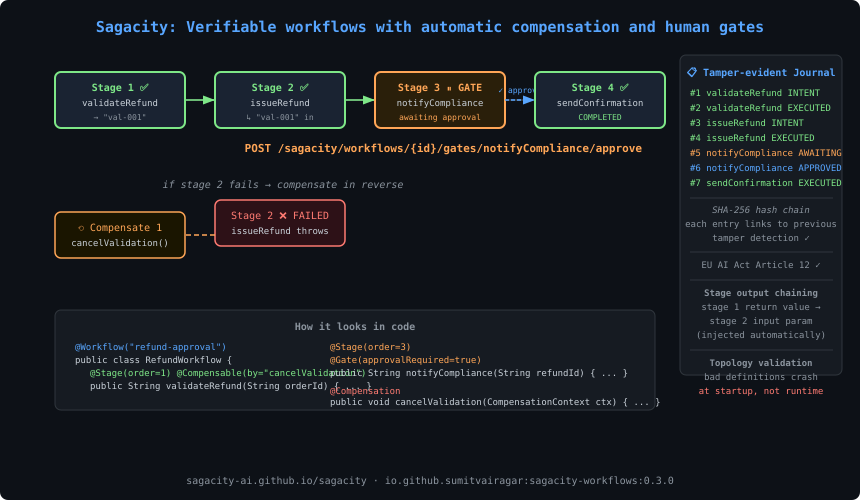
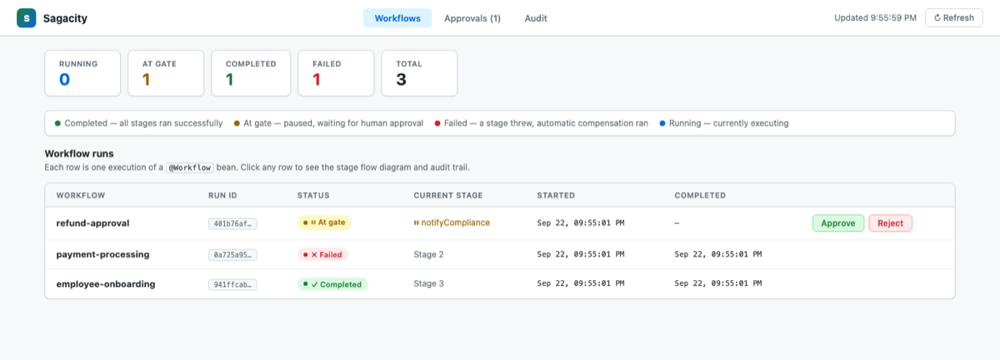
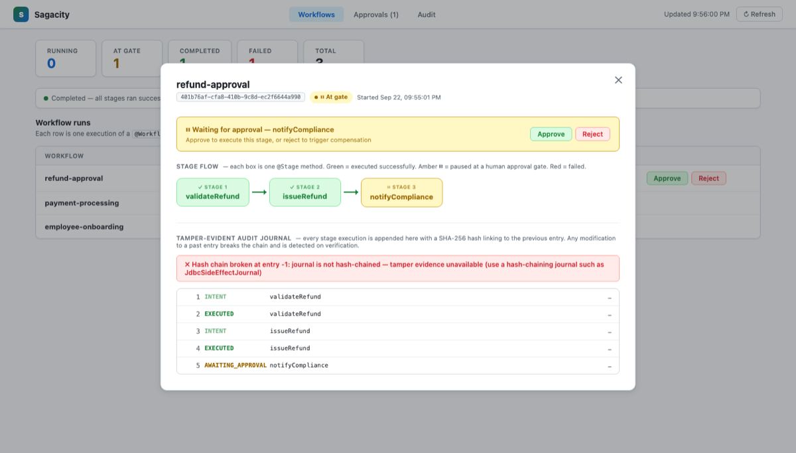

# Sagacity

[](LICENSE)
[](https://openjdk.org/)
[](https://spring.io/projects/spring-ai)
[](https://github.com/sagacity-ai/sagacity/actions/workflows/build.yml)
[](https://central.sonatype.com/artifact/io.github.sumitvairagar/sagacity-spring-boot-starter)
[](https://sagacity-ai.github.io/sagacity/)
[]()

**Production safety for Spring AI agents.** Pause before irreversible actions. Approve or reject. Unwind automatically if rejected. Every decision tamper-evident.

<p align="center">
  
</p>

---

## The Problem

Your AI agents are making decisions that affect real people — approving transactions, sending emails, updating records, charging cards. Right now:

- ❌ **Nobody approved** the irreversible action before it ran
- ❌ **Nothing undoes** completed steps when something later fails
- ❌ **No compliance-grade record** of what happened, in what order, who approved what
- ❌ **No answer** when legal asks "can you prove your AI didn't act without authorisation?"

Every framework lets agents act. **None requires a human to approve before they do. None compensates when they shouldn't have. None produces evidence for a regulator.**

Sagacity is the safety layer that sits between your Spring AI agent and the actions it takes.

---

## How it works

Add `@Compensable` to any Spring AI `@Tool` method. Wrap your tools. Run your agent inside `sagacity.saga()`. That's the entire integration.

```java
@Component
public class OrderTools {

    @Tool(description = "Reserve inventory for a product")
    @Compensable(by = "releaseInventory")           // ← undo this if anything fails later
    public String reserveInventory(String productId, int quantity) {
        return inventory.reserve(productId, quantity);  // returns "res-8891"
    }

    @Compensation
    public void releaseInventory(CompensationContext ctx) {
        inventory.release(ctx.result());   // ctx.result() = "res-8891"
    }

    @Tool(description = "Charge the customer")
    @Compensable(by = "refundCustomer")
    public String chargeCustomer(String customerId, double amount) {
        return payments.charge(customerId, amount);
    }

    @Compensation
    public void refundCustomer(CompensationContext ctx) {
        payments.refund(ctx.result());
    }

    @Tool(description = "Send wire transfer — cannot be undone")
    @Compensable(reversibility = Reversibility.IRREVERSIBLE)
    public String sendWireTransfer(String orderId) {
        // Saga pauses here. Approve via REST or UI before this executes.
        return payments.wire(orderId);
    }
}
```

```java
// One line change from your existing agent
SagaResult<ChatResponse> result = sagacity.saga("order-" + UUID.randomUUID(), () ->
    chatClient.prompt()
        .user(userRequest)
        .toolCallbacks(sagacity.wrap(orderTools))   // ← wrap your tools
        .call().chatResponse());

switch (result.status()) {
    case COMPLETED         -> // all tools ran, nothing failed
    case AWAITING_APPROVAL -> // sendWireTransfer paused — waiting for human
    case COMPENSATED       -> // something failed, earlier tools undone automatically
    case COMPENSATION_FAILED -> // failed AND undo also failed — needs human investigation
}
```

---

## Documentation

Full documentation: **[sagacity-ai.github.io/sagacity](https://sagacity-ai.github.io/sagacity/)**

| | |
|---|---|
| [Getting started](https://sagacity-ai.github.io/sagacity/getting-started/) | Working example in five minutes |
| [Approval gates](https://sagacity-ai.github.io/sagacity/guides/approval-gates/) | Human sign-off before irreversible tool calls |
| [Compensation](https://sagacity-ai.github.io/sagacity/guides/compensation/) | Automatic undo when an agent step fails |
| [Audit and verification](https://sagacity-ai.github.io/sagacity/guides/audit-and-verification/) | Export and verify the tamper-evident journal |
| [Production checklist](https://sagacity-ai.github.io/sagacity/guides/production-checklist/) | Read before pointing this at real money |
| [Threat model](https://sagacity-ai.github.io/sagacity/concepts/threat-model/) | What the audit trail does and does not defend against |
| [REST API](https://sagacity-ai.github.io/sagacity/reference/rest-api/) | Endpoint reference |
| [Annotations](https://sagacity-ai.github.io/sagacity/reference/annotations/) | `@Compensable`, `@Compensation`, `Reversibility` |

---

## Quick Start

> **Want a runnable example in 5 minutes?**
> Clone [sagacity-quickstart](https://github.com/sumitvairagar/sagacity-quickstart) — a self-contained Spring Boot app that shows compensation and the audit trail in action.

### 1. Add the dependency

```xml
<dependency>
    <groupId>io.github.sumitvairagar</groupId>
    <artifactId>sagacity-spring-boot-starter</artifactId>
    <version>0.4.0</version>
</dependency>
```

### 2. Annotate your tools

```java
@Component
public class OrderTools {

    @Tool(description = "Reserve inventory for a product")
    @Compensable(by = "releaseInventory")
    public String reserveInventory(String productId, int quantity) {
        return inventoryService.reserve(productId, quantity);
    }

    @Compensation
    public void releaseInventory(CompensationContext ctx) {
        inventoryService.release(ctx.result());
    }

    @Tool(description = "Charge the customer")
    @Compensable(by = "refundCustomer", retries = 3, retryOn = { PaymentTimeoutException.class })
    public String chargeCustomer(String customerId, double amount) {
        return paymentService.charge(customerId, amount);
    }

    @Compensation
    public void refundCustomer(CompensationContext ctx) {
        paymentService.refund(ctx.result());
    }

    @Tool(description = "Send wire transfer — cannot be undone")
    @Compensable(reversibility = Reversibility.IRREVERSIBLE)
    public String sendWireTransfer(String orderId) {
        return payments.wire(orderId);
    }
}
```

### 3. Run your agent in a saga

```java
@Service
public class OrderAgent {

    @Autowired private Sagacity sagacity;
    @Autowired private ChatClient chatClient;
    @Autowired private OrderTools orderTools;

    public SagaResult<ChatResponse> placeOrder(String userRequest) {
        return sagacity.saga("order-" + UUID.randomUUID(), () ->
            chatClient.prompt()
                .user(userRequest)
                .toolCallbacks(sagacity.wrap(orderTools))
                .call().chatResponse());
    }
}
```

### 4. Configure (application.yml)

```yaml
sagacity:
  enabled: true
  schema-init: true
  approval-endpoints-enabled: true
  retry:
    initial-delay-ms: 200
    backoff-multiplier: 2.0

spring:
  datasource:
    url: jdbc:postgresql://localhost:5432/myapp
    username: myuser
    password: mypass
```

No DataSource? Sagacity falls back to an in-memory journal (great for dev/testing).

---

## Embedded UI

Open `http://localhost:8080/sagacity/ui`. No configuration, no separate deployment, no login required.

**List view** — all agent runs at a glance, approve/reject gates inline:

<p align="center">
  
</p>

**Click any row** to open the audit journal with hash verification:

<p align="center">
  
</p>

Disable with `sagacity.ui-enabled=false`.

---

## REST API

| Method | Endpoint | Description |
|--------|----------|-------------|
| `GET` | `/sagacity/approvals` | List all pending approval requests |
| `POST` | `/sagacity/approve/{sagaId}/{seq}` | Approve (body: `{"approver": "admin@co.com"}`) |
| `POST` | `/sagacity/reject/{sagaId}/{seq}` | Reject + trigger compensation |
| `POST` | `/sagacity/resume/{sagaId}/{seq}` | Execute an approved tool |
| `GET` | `/sagacity/audit/{sagaId}` | Export journal as JSON Lines |
| `GET` | `/sagacity/audit/{sagaId}/verify` | Verify hash chain integrity |

---

## Features

| Feature | Status | Description |
|---------|--------|-------------|
| `@Compensable` / `@Compensation` | ✅ | Declare undo logic per tool |
| Reverse-order compensation | ✅ | On failure, undo steps in reverse |
| Universal JDBC journal + SHA-256 hash chain | ✅ | PostgreSQL, MySQL, MariaDB, Oracle, H2, SQLite |
| Human approval gates | ✅ | `IRREVERSIBLE` tools suspend until approved |
| Approve/Reject REST API | ✅ | With approver identity in audit trail |
| Audit export (JSON Lines) | ✅ | Compliance-ready, one entry per line |
| Hash chain verification | ✅ | Detect any modification to history |
| Spring Boot Starter | ✅ | Zero-config auto-wiring |
| Concurrent-safe | ✅ | Optimistic concurrency + unique-constraint retry |
| Tool-level retry | ✅ | `@Compensable(retries=3, retryOn={...})` with exponential backoff |
| Sagacity Cloud journal | ✅ | Write journal to hosted cloud instead of local DB |
| Embedded UI (`/sagacity/ui`) | ✅ | Zero-config dashboard — gate approvals, audit viewer |
| Durable approval state | ✅ **v0.4.0** | Approval gates survive JVM restarts |

---

## How It Works

```
ChatClient → ToolCallingManager → ToolCallback
                                       ↑
                              SagacityToolCallback (decorator)
                                       │
                  ┌────────────────────┼────────────────────┐
                  │                    │                    │
            1. Journal           2. Execute           3. Journal
               INTENT             the tool            EXECUTED/FAILED
                  │                    │
                  │    (if IRREVERSIBLE)│   (on failure)
                  │         ↓          │        ↓
                  │  AWAITING_APPROVAL │  CompensationRunner
                  │  (saga suspends)   │  walks journal backward
                  │                    │  runs @Compensation methods
```

---

## How Sagacity relates to Temporal

Temporal solves **durable execution** — if your process crashes, your workflow replays from exactly where it stopped. It handles distributed workers, cross-service orchestration, and horizontal scale. That is a genuinely hard infrastructure problem and Temporal solves it well.

That is not the same problem Sagacity solves.

A process that resumes perfectly after a crash still leaves you with a charged card when the business logic says the order should be abandoned. Crash recovery cannot undo a side effect. **A refund is not a retry.**

Sagacity answers: when your agent succeeds technically but the business says "this should not have happened," what gets unwound, who approved it before it ran, and what is the tamper-evident record?

| | Temporal | Sagacity |
|---|---|---|
| Durable execution (survive process crash) | ✅ cluster-backed | ❌ not the same |
| Distributed workers, horizontal scale | ✅ | ❌ single JVM |
| Spring AI native integration | ✅ `temporal-spring-ai` (Preview) | ✅ `sagacity-spring-boot-starter` |
| Undo side effects on **business** failure | ⚠️ possible via child workflow pattern | ✅ annotation-driven, first-class |
| Tamper-evident SHA-256 audit trail | ❌ event history is operational, not compliance-grade | ✅ |
| EU AI Act Article 12 compliance | ❌ | ✅ |
| Human approval gates (first-class primitive) | ❌ | ✅ `Reversibility.IRREVERSIBLE` |
| New infrastructure to run | ✅ cluster or Temporal Cloud | ❌ library only |
| Adopt without rewriting agent code | ❌ must model as Workflows + Activities | ✅ annotate existing Spring AI tools |

**They are complementary.** Use Temporal for durability and scale. Use Sagacity for compensation, approval gates, and the compliance audit trail.

---

## Architecture

```
sagacity-core                    # Journal, hash chain, compensation runner, approval store
                                 # Zero framework dependencies — reusable anywhere

sagacity-spring-ai               # SagacityToolCallback, @Compensable processing, Sagacity facade

sagacity-spring-boot-starter     # Auto-config wiring sagacity-core + sagacity-spring-ai

sagacity-examples                # Order-placing agent demo with induced failure
```

---

## EU AI Act Article 12

The EU AI Act (enforceable from **2026-08-02**) requires tamper-evident, traceable logs for high-risk AI systems.

| Article 12 Requirement | Sagacity Feature |
|------------------------|-----------------|
| Automatic logging | Every tool call journaled (INTENT/EXECUTED/FAILED) |
| Tamper-evident | SHA-256 hash chain, verifiable via REST API |
| Traceable decisions | Saga run ID links all steps; approval identity recorded |
| Retention | JDBC persistence (PostgreSQL, MySQL, and more) |

---

## Roadmap

| Milestone | Status |
|-----------|--------|
| M0 — Walking skeleton | ✅ Done |
| M1 — Postgres journal + hash chain | ✅ Done |
| M2 — Approval gates + audit export | ✅ Done |
| M3 — Spring Boot Starter + Maven Central | ✅ Done (v0.1.0) |
| M3.5 — Cloud journal + retry + universal JDBC | ✅ Done (v0.2.0) |
| M4 — Embedded UI (`/sagacity/ui`) | ✅ Done (v0.3.0) |
| M5 — Durable approval state (JDBC-backed) | ✅ Done (v0.4.0) |
| M6 — LangChain4j adapter | 📋 Planned |
| M6 — `sagacity-risk` / `RiskScorer` facade | 📋 Planned |

See [docs/about/roadmap.md](docs/about/roadmap.md) for details.

---

## Contributing

Contributions welcome! See [CONTRIBUTING.md](CONTRIBUTING.md) for guidelines.

**High-impact areas:**
- LangChain4j adapter (`sagacity-langchain4j`)
- MCP tool support — compensations for MCP-server tools
- Typed compensation methods — bind original parameters directly
- `sagacity-risk` — `RiskScorer` facade for pre-execution risk scoring

---

## License

Apache License 2.0 — see [LICENSE](LICENSE).

---

<p align="center">
  <strong>AI doesn't undo its mistakes. Sagacity does.</strong><br><br>
  Built by <a href="https://github.com/sumitvairagar">@sumitvairagar</a> |
  <a href="https://youtube.com/@EngineerInAi">YouTube</a> |
  <a href="https://sagacity-ai.github.io/sagacity/">Docs</a>
</p>
