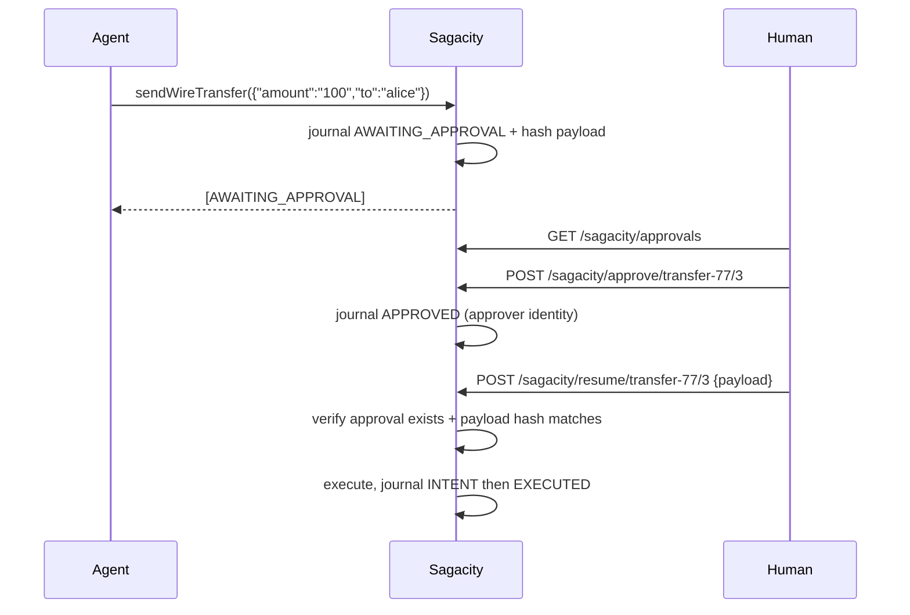

# Approval gates for irreversible tools

Some actions have no undo. A wire transfer settles; a deletion is permanent; an
email is read. For those, compensation is the wrong tool — the right one is to
stop before executing and ask a person.

## Mark the tool irreversible

```java
@Tool(description = "Send a wire transfer")
@Compensable(reversibility = Reversibility.IRREVERSIBLE)
public String sendWireTransfer(String amount, String to) {
    return bank.wire(to, amount);
}
```

No `by = "..."` is needed. `IRREVERSIBLE` is the one case where `@Compensable`
declares no compensation, because there isn't one.

The three levels:

| Reversibility | Meaning | Behaviour |
|---|---|---|
| `REVERSIBLE` | perfect undo exists | compensates on failure |
| `COMPENSATABLE` *(default)* | imperfect undo — a correction, not an erasure | compensates on failure |
| `IRREVERSIBLE` | no undo | **suspends the saga for human approval** |

## What happens at runtime

When the agent calls an `IRREVERSIBLE` tool inside a saga, the tool **does not
execute**. Instead Sagacity:

1. journals an `AWAITING_APPROVAL` entry holding the exact input payload
2. hashes that payload (SHA-256) and stores it on the approval request
3. returns `[AWAITING_APPROVAL] Tool 'sendWireTransfer' requires human approval`
   to the model
4. returns `SagaResult.status() == AWAITING_APPROVAL` from `saga(...)`

```java
SagaResult<?> result = sagacity.saga("transfer-77", () -> agent.run());

if (result.status() == SagaStatus.AWAITING_APPROVAL) {
    log.info("waiting on human for {}", result.awaitingToolName());
}
```

## The three-step flow

Approving is **not** executing. These are deliberately separate calls:



```bash
# 1. See what is pending
curl localhost:8080/sagacity/approvals

# 2. Record the human decision
curl -X POST localhost:8080/sagacity/approve/transfer-77/3 \
  -H 'Content-Type: application/json' \
  -d '{"approver":"manager@company.com"}'

# 3. Execute, bound to the payload that was approved
curl -X POST localhost:8080/sagacity/resume/transfer-77/3 \
  -H 'Content-Type: application/json' \
  -d '{"payload":"{\"amount\":\"100\",\"to\":\"alice\"}"}'
```

Or from Java:

```java
sagacity.approve("transfer-77", seq, "manager@company.com");
SagaResult<String> r = sagacity.resumeSaga("transfer-77", seq, livePayload);
```

## Why approve and resume are separate

This is the part that matters, and it is not incidental design.

A gate that only checks "did someone approve saga X step 3?" is defeated by
**stale approval**: the human approves a $100 transfer to Alice, the model
re-plans between approval and execution, and a $999,999 transfer to Mallory runs
under the same approval. The approver saw one thing; another thing happened.

Sagacity binds the approval to the payload. At request time it stores
`SHA-256(input)`. At execution time it hashes the live payload and compares.

```java
// Approved for this:
{"amount":"100","to":"alice"}

// Resumed with this:
{"amount":"999999","to":"mallory"}

// → REJECTED, journaled, prior steps compensated, tool never called
```

Verification is **exact and byte-level**. Even reformatting is rejected:

```java
{"amount":"100","to":"alice"}          // approved
{ "amount": "100", "to": "alice" }     // rejected — whitespace differs
```

That is intentional. A hash cannot tell a cosmetic reformat from a meaningful
edit, so it refuses both. Pass through the payload you were given, unmodified.

`resume` enforces three conditions, and fails closed on each:

| Condition | Failure |
|---|---|
| A pending approval request exists | `404`, `IllegalStateException` |
| An `APPROVED` decision was journaled for it | `409` — *"no human approval recorded"* |
| The live payload hash matches the approved one | `409` — *"payload changed since approval"* |

An approval request carrying **no** payload hash is refused too. An approval
that never recorded what was approved cannot be shown to match, so it is
rejected rather than waved through.

!!! warning "A pending request is not an approval"
    `approve()` deliberately leaves the request in the store so `resume` can
    still verify the payload. Store state therefore looks identical before and
    after approval — which is exactly why `resume` checks the journal for an
    `APPROVED` entry rather than trusting the store.

## Rejecting

```bash
curl -X POST localhost:8080/sagacity/reject/transfer-77/3 \
  -H 'Content-Type: application/json' \
  -d '{"approver":"manager@company.com"}'
```

Rejection journals the decision and compensates every step that already ran. The
pending request is dropped, so it cannot be resumed afterward.

## What ends up in the journal

```
seq 1  reserveInventory  EXECUTED           {"sku":"SKU-9"}
seq 2  sendWireTransfer  AWAITING_APPROVAL  {"amount":"100","to":"alice"}
seq 3  approval-gate     APPROVED           approver=manager@company.com
seq 4  sendWireTransfer  INTENT             {"amount":"100","to":"alice"}
seq 5  sendWireTransfer  EXECUTED           transfer-ok
```

Everything a reviewer needs is on the chain: what was proposed, who approved it,
and that the thing executed was the thing approved. The `APPROVED` decision is
read back **from the journal**, not a side table, so the record that gates
execution is covered by the same tamper evidence as everything else.

## Limitations to know about

- **The approver identity is whatever the caller says it is.** Sagacity records
  `{"approver":"..."}` verbatim and does not authenticate it. Put the endpoints
  behind your own auth and pass the authenticated principal — see the
  [production checklist](production-checklist.md).
- **No approval expiry.** A request pending for a week is still approvable. If
  that matters, check the `AWAITING_APPROVAL` entry's timestamp yourself.
- **Pending requests need a `DataSource` to survive a restart.** With one, they
  are stored in `sagacity_approval_request` automatically; without one they are
  in memory and a deploy strands them.
- **No policy versioning.** The journal does not record which approval policy
  was in force at decision time.
